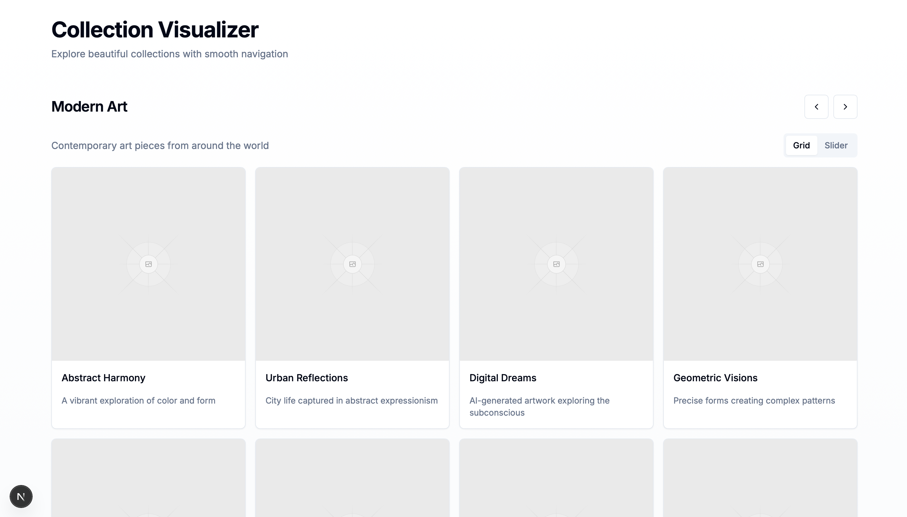
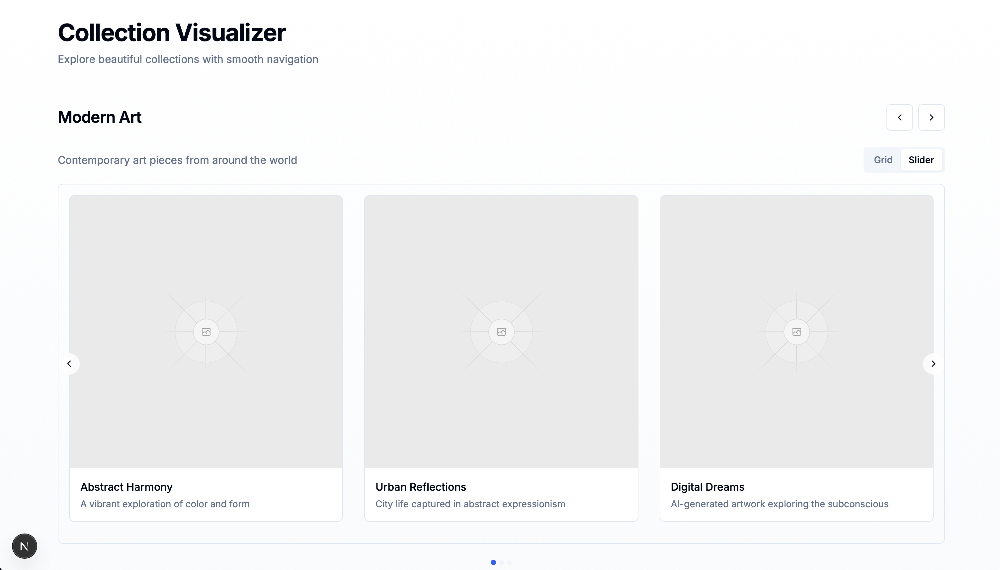

# Collection Gallery

A modern web application built with Next.js and React, featuring a collection of components and UI elements for creating beautiful and interactive user interfaces.

## Preview

Below is a grid of preview images showcasing the UI components and features available in the Collection Gallery

<div class="grid grid-cols-2 gap-8">
  
  
</div>

## Features

- Built with Next.js 15+ and React 19+
- Modern UI components using Radix UI
- Responsive design with Tailwind CSS
- Dark/Light theme support via next-themes
- Interactive components including:
  - Dialogs and Modals
  - Navigation Menus
  - Toast Notifications
  - Carousel Components
  - Form Elements
  - Interactive UI Controls

## Tech Stack

- **Framework**: Next.js 15+
- **UI Components**: Radix UI
- **Styling**: Tailwind CSS
- **State Management**: React Hooks
- **Form Handling**: React Hook Form
- **Date Handling**: date-fns
- **Carousel**: embla-carousel-react
- **Icons**: lucide-react

## Getting Started

1. Clone the repository
2. Install dependencies:
   ```bash
   npm install
   ```
3. Start the development server:
   ```bash
   npm run dev
   ```

The application will be available at `http://localhost:3000`

## Project Structure

```
.
├── app/              # Next.js app directory
├── components/       # Reusable UI components
├── hooks/           # Custom React hooks
├── lib/             # Utility functions
├── public/          # Static assets
├── styles/          # Global styles and Tailwind configuration
└── types/           # TypeScript type definitions
```

## Development

The project uses TypeScript for type safety and modern development practices. All components are built using the latest React patterns and best practices.

## Available Scripts

- `npm install` - Install dependencies
- `npm run dev` - Start development server
- `npm run build` - Build for production
- `npm run start` - Start production server

## Acknowledgments

The project is based on the v0.dev template.

## License

This project is licensed under the MIT License - see the LICENSE file for details.

